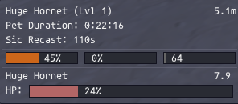
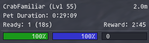
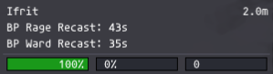

# PetMe
Addon for FFXI / AshitaXI v4 that displays detailed pet information. As of the moment
PetMe displays the following information:

All Jobs:
* Pet name and distance
* Basic pet stats: HP/MP/TP
* Pet Target

BST:
* Charm & Jug duration
* Pet Level
* Ready / Sic and Reward recast timers
* Healing tick counter (Stay)

SMN:
* Bloodpact timers

DRG:
* Nothing specific (yet)

The PetMe information displayed is largely configurable. After loading (by typing in "/addon load petme" - w/o quotes)
the configuration menu can be brought up by typing in /petme or /pm.

## Install:
To install, grab the latest release (a.k.a. stable version) from [Releases](https://github.com/m4thmatic/PetMe/releases).
Unzip and drop the contents (the "petme" folder) into your *Game > addons* folder.

## Commands:
### /petme or /pm
 `/pm` *Brings up the configuration menu*

## Notes:
1)	PetMe must already be loaded during a charm/call beast action to get the pet level & duration (this information is
	not available in the client itself, and thus must be calculated at charm/call time).
2)	This addon was designed with the HorizonXI private server in mind. This addon should work on retail / other private
	servers, with the caveat that the jug pet level/duration table will need to be updated w/
	appropriate values & additional pets.