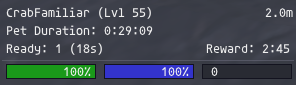

# PetMe
Addon for FFXI / AshitaXI v4 that displays BST pet information (for both charmed & jug pets). As of the moment
PetMe displays the following information:
* Pet name, level, and distance
* Charm duration
* Ready / Sic and Reward recast timers
* Healing tick counter (Stay)
* Basic pet stats: HP/MP/TP
* Pet Target

The PetMe information displayed is largely configurable. After loading (by typing in "/addon load petme" - w/o quotes)
the configuration menu can be brought up by typing in /petme or /pm.

## Notes:
1)	PetMe must already be loaded during a charm/call beast action to get the pet level & duration (this information is
	not available in the client itself, and thus must be calculated at charm/call time).
2)	Any +charm from any gear must be set manually in the configuration menu. I hope to eventually automate this, but it
	is non-trivial, therefore for the time being this is a manual process. This will need to be updated	anytime you
	modify your +charm gearset.
3)	I personally only play on the HorizonXI private server. This addon should work on retail / other private
	servers, with a couple of caveats. In particular, the jug pet level/duration table will need to be updated w/
	appropriate values & additional pets.
	* Note: Horizon uses different values than ASB (and presumably retail) for Sic/Ready merits, so the number of Ready charges/countdown may be messed up.

## Planning to add:
1) Automated calculation of +charm
2) Take into account using ability Familiar (reset charm duration)
3) Pet buffs / debuffs (this may not be feasible)
4) Pet resting status (may not be feasible as well)

## Commands:
### /petme or /pm
 `/pm` *Brings up the configuration menu*
